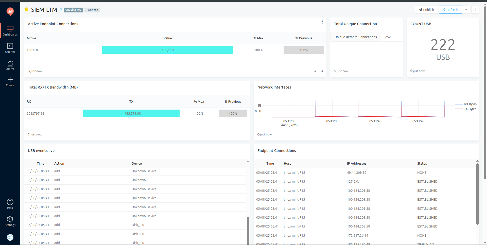

# SIEM-LTM Dashboard Monitoring Project

##  Dashboard Preview




##  Project Overview

This project provides a lightweight SIEM-lite dashboard for real-time monitoring of USB device events, endpoint device connections, and network interface statistics. Designed for minimal resource environments, it integrates Python scripts, PostgreSQL, and Redash visualizations, with centralized data collection via Tailscale.

##  Project Structure

```
/live-system-monitor
 ├── queries/
 │     └── redash_queries.md
 ├── requirements.txt
 ├── tailscale-config.md
 ├── sql/
 │     └── schema.sql
 ├── systemd/
 │     └── usb_monitor.service
 │     └── endpoint_monitor.service
 │     └── network_monitor.service
 ├── endpoint_monitor.py
 ├── network_monitor.py
 ├── usb_monitor.py
 ├── live_monitor.py
 └── README.md
```

##  Setup Instructions

### 1. Clone Repository

```bash
git clone https://github.com/LAVR-69/SIEM-LTM-Dashboard.git
cd SIEM-LTM-Dashboard/live-system-monitor
```

### 2. Python Virtual Environment

```bash
python3 -m venv venv
source venv/bin/activate
pip install -r requirements.txt
```

### 3. PostgreSQL Database Setup

* Create database: `network_monitor`
* Create user: `monitor_user` with appropriate privileges.
* Execute schema:

```bash
psql -U monitor_user -d network_monitor -f sql/schema.sql
```

### 4. Tailscale Configuration

Refer to `tailscale-config.md` for detailed setup of device connectivity over Tailscale VPN.

### 5. Systemd Services

* Copy service files from `/systemd/` to `/etc/systemd/system/`

```bash
sudo cp systemd/*.service /etc/systemd/system/
```

* Reload and enable services:

```bash
sudo systemctl daemon-reload
sudo systemctl enable usb_monitor.service
sudo systemctl enable endpoint_monitor.service
sudo systemctl enable network_monitor.service
```

* Start services:

```bash
sudo systemctl start usb_monitor.service
sudo systemctl start endpoint_monitor.service
sudo systemctl start network_monitor.service
```

### 6. Redash Dashboard

* Import Redash queries from `/queries/redash_queries.md`.
* Create widgets for KPIs and logs as per the queries documentation.
* Organize widgets into "SIEM-LT Dashboard".

<<<<<<< HEAD
### 7. Important Note for Network Scanning
=======
##  Files Description
>>>>>>> 1c1c1a2 (Updated README with screenshot and fixed structure)

If you are performing a network scan or monitoring local network interfaces, ensure you edit the subnet and IP address in the relevant Python scripts and queries. The current configurations use the developer's local network IP ranges. Update these to reflect your target network environment before execution.

<<<<<<< HEAD
##  Files Description

queries/redash_queries.md: Contains all SQL queries for Redash visualizations & KPIs.

* requirements.txt: Python dependencies.

* tailscale-config.md: Tailscale setup instructions.

* sql/schema.sql: PostgreSQL table schemas for USB Events, Endpoints, and Network Interfaces.

* systemd/: Contains service files to automate Python scripts on system boot.

* endpoint_monitor.py: Script for monitoring active endpoint device connections.

* network_monitor.py: Script for capturing network interface RX/TX statistics.

* usb_monitor.py: Script for monitoring USB device plug-in/out events.

* live_monitor.py: Optional combined live monitoring controller script.


=======
>>>>>>> 1c1c1a2 (Updated README with screenshot and fixed structure)
##  Known Issues

* PostgreSQL IP must be updated if Tailscale IP changes.
* Lightweight design omits advanced correlation rules.
* Filebeat/Fluent Bit is not used; Python scripts push logs directly.

##  Contribution

* Project Lead: Aviral Sharma
* Redash & Docker Setup: Afreen
* Python & Systemd Integration: Aviral

##  Project Development Journey & Challenges

### Initial Setup Challenges:

* Faced Python dependency issues while setting up pyudev and psutil modules.
* Encountered PostgreSQL connection failures due to Tailscale IP mismatches.

### Solutions Implemented:

* Used isolated Python virtual environments to control package versions.
* Created a dedicated Tailscale subnet for stable IP allocations.
* Systemd services were configured for auto-restart upon failures.

### Redash Visualization Hurdles:

* Initial SQL queries referenced non-existent columns like `local_address` and `is_up`.
* Schema and script alignment fixed these discrepancies.

### Continuous Monitoring Pipeline:

* USB events monitored using pyudev, pushed to PostgreSQL.
* Endpoint connections tracked via psutil’s net\_connections.
* Network RX/TX statistics fetched from psutil’s net\_io\_counters.

### Dashboard KPIs and Widgets:

* USB Device Logs
* Active Endpoint Connections
* Live Network Interface Stats
* KPIs: Active USBs, Live Connections, Bandwidth Utilization


##  Final Checklist

* [x] PostgreSQL DB & User Created.
* [x] Tailscale Connected Across Devices.
* [x] Python scripts running via systemd.
* [x] Redash Dashboard configured with queries & widgets.

---

For any issues, please raise under **Issues tab** or contact via GitHub Discussions.

---

